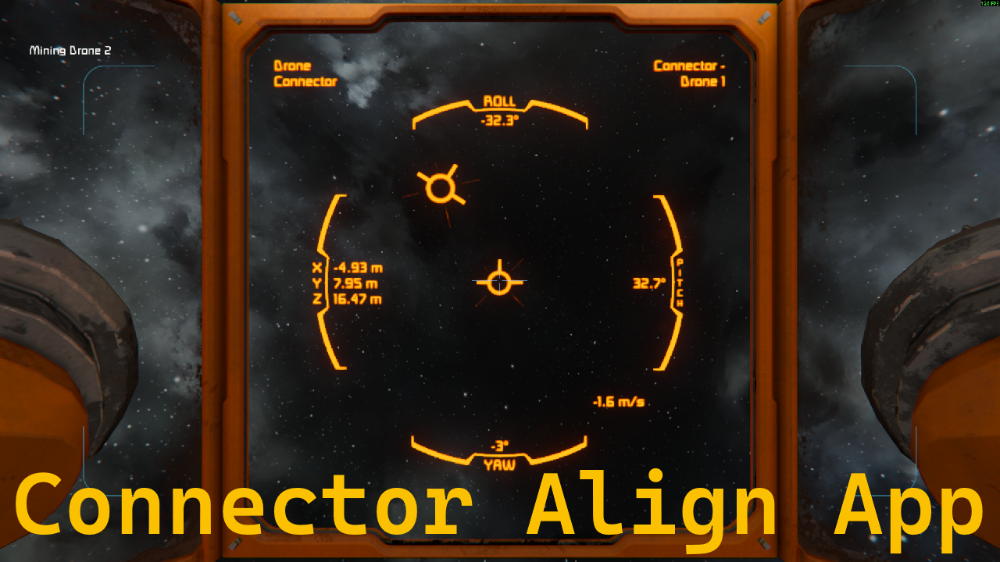


# Connector Align App

The Connector Align App is a modification for 
[Space Engineers by Keen Software House](https://www.spaceengineersgame.com/home/). It adds a new 
selectable app to any LCD Panels in the game.

The app allows you to see positional and rotational offset from a connector. It automatically 
detects the best pair or allows setting a specific connector from the grid. It also allows for 
connectors on subgrids.

There is also a "companion script" for the programmable block that allows switching through 
different apps for the LCD in an easy manner. You can find it here:
https://github.com/Kiminaze/SELCDScreenAppSelector

### Video Showcase

https://www.youtube.com/watch?v=5Y65UWF-Vok

## 📋 Features

- Visual representation of positional and rotational offset.
  - X, Y and Z position data down to 1 cm resolution.
  - Pitch, yaw and roll rotation angles down to 0.1° resolution.
- Shows speed difference of both grids.
- Shows names of both connectors of current detected pair.
- Automatically adjusts to fit screen size.
- Toggle between data shown in relation to the LCD or the connector.
- Toggle between small and large font.
- Set custom name of a specific connector.
- Works with any connector on the grid of the LCD and all subgrids through mechanical connections 
  (rotor, piston, hinge).

## Known issues

- Adding/removing grids through mechanical connections (rotor, piston, hinge) requires a manual 
update. Just select a different app in the LCD screen settings and reselect this app.
- Performance could be better. Currently ~0.1-0.15 ms per update per app being updated (at 6 
updates per second).

## 💾 Download

https://steamcommunity.com/sharedfiles/filedetails/?id=3687605561

## Copyright

Connector Alignment App for Space Engineers

Copyright (C) 2026 Philipp Decker - kiminaze@yahoo.de

This program is free software: you can redistribute it and/or modify
it under the terms of the GNU General Public License as published by
the Free Software Foundation, either version 3 of the License, or
(at your option) any later version.

This program is distributed in the hope that it will be useful,
but WITHOUT ANY WARRANTY; without even the implied warranty of
MERCHANTABILITY or FITNESS FOR A PARTICULAR PURPOSE.  See the
GNU General Public License for more details.

You should have received a copy of the GNU General Public License
along with this program.  If not, see <https://www.gnu.org/licenses/>.
